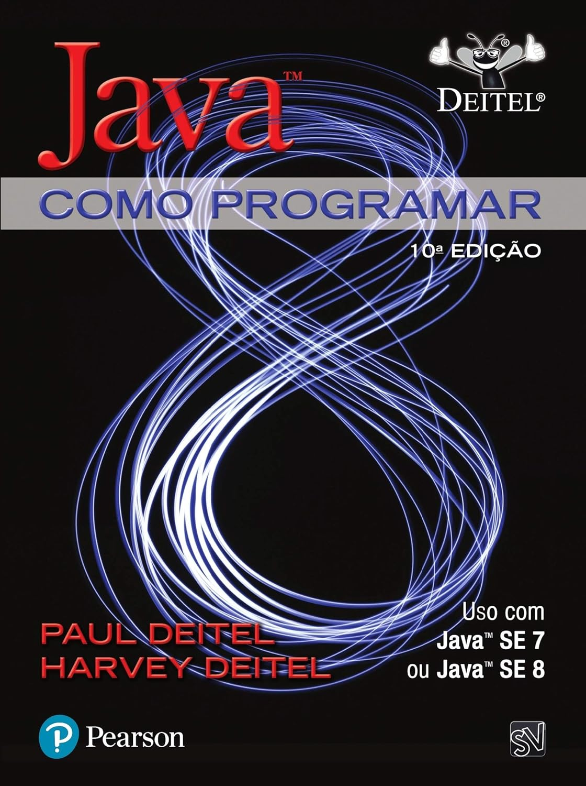

# ☕ Estudos de Java - Deitel & Deitel

Repositório dedicado ao estudo do livro **Java: Como Programar**, utilizando o **VS Code**.

## 🚀 Progresso de Estudo
- [x] Cap 01: Introdução à Computação
- [ ] Cap 02: Introdução a Aplicativos Java (Em andamento...)
- [ ] Cap 03: Classes, Objetos, Métodos e Strings

## 🛠️ Ferramentas Utilizadas
- **JDK:** 17 ou superior
- **IDE:** Eclipse
- **Extensões:** Extension Pack for Java (Microsoft)

# ☕ Estudos de Java - Deitel & Deitel

  

